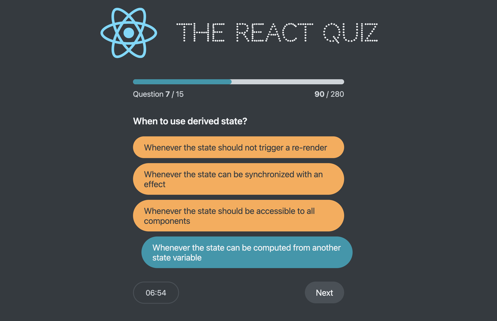
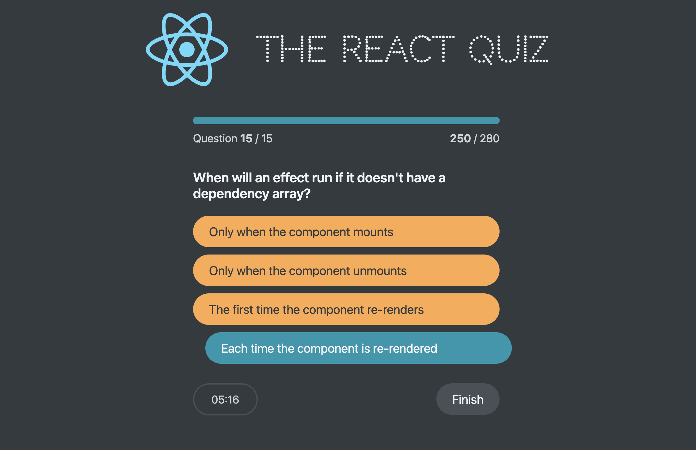

# The React Quiz 🧑🏼‍💻
A dynamic and interactive quiz application built with React, showcasing custom hooks and state management via useReducer for an enriched user experience. 

- The app features a seamless flow from the loading stage to quiz completion, with a timer for each question, error handling, and a scoring system. It integrates a custom fetching mechanism to load quiz questions and leverages React's powerful hooks to handle the quiz state transitions, from start to finish, including a high score tracker.
- The React Quiz offers a clean, user-friendly interface with components like a progress bar, question display, and a conclusive finish screen, making the quiz taking both challenging and fun.

# Design & Layout 
> 
> 
